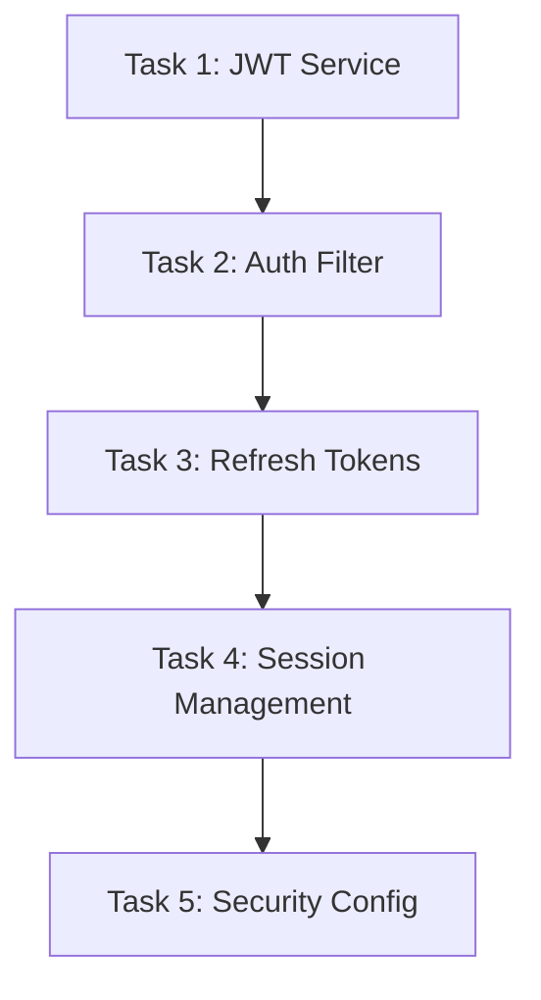

# JWT Authentication & Session Management Implementation Guide

**Epic B0-7**: Complete JWT Authentication with Redis Session Management  
**Status**: Ready for Implementation  
**Estimated Effort**: 3-5 days  

## Overview

This folder contains detailed implementation prompts for building a production-ready JWT authentication system with Redis-based session management. Each task includes specific prompts, verification steps, and integration requirements.

## Task Dependencies



**⚠️ Important**: Tasks must be completed in order due to dependencies.

## Current Project State

### ✅ Already Complete
- JWT dependencies and configuration
- Redis infrastructure with UserSession
- Basic security configuration framework
- Unit tests for JWT configuration

### ❌ Critical Issues to Fix
- **UserSession type mismatch**: Uses `Long userId` but User entity uses `UUID`
- **Missing JWT service implementation**: No actual token generation/validation
- **Security bypass**: Current SecurityConfig uses `permitAll()`
- **No authentication endpoints**: Missing login, logout, refresh

## Implementation Order

### Phase 1: Core Authentication (Days 1-2)
1. **[Task 1: JWT Service](./task1-b0-8-jwt-service.md)**
   - Create JwtService with token generation and validation
   - 4 implementation steps with prompts
   - ~4-6 hours implementation time

2. **[Task 2: Authentication Filter](./task2-b0-9-authentication-filter.md)**
   - Replace permitAll() with proper JWT authentication
   - Spring Security integration
   - ~3-4 hours implementation time

### Phase 2: Token Management (Day 2-3)
3. **[Task 3: Refresh Token System](./task3-b0-10-refresh-token-system.md)**
   - Redis-based refresh tokens with rotation
   - Security breach detection
   - ~4-5 hours implementation time

### Phase 3: Session Management (Day 3-4)
4. **[Task 4: Redis Session Management](./task4-b0-11-redis-session-management.md)**
   - Fix UserSession type mismatch (CRITICAL)
   - Device fingerprinting and session tracking
   - ~3-4 hours implementation time

### Phase 4: Security Hardening (Day 4-5)
5. **[Task 5: Security Configuration](./task5-b0-12-security-configuration.md)**
   - CORS, security headers, rate limiting
   - Security monitoring and alerts
   - ~4-5 hours implementation time

## Quick Start Guide

### 1. Validate Current Setup
```bash
# Ensure dependencies are installed
mvn clean compile

# Verify Redis is running
redis-cli ping
# Should return "PONG"

# Run existing tests
mvn test
# Should pass all current tests
```

### 2. Start with Task 1
```bash
# Open the first task
cat prompts/task1-b0-8-jwt-service.md

# Follow Step 1 prompt to create JwtService
# Implement → Test → Verify → Next step
```

### 3. Implementation Workflow
For each task:
1. **Read the full task file** - understand context and requirements
2. **Follow prompts in order** - each step builds on the previous
3. **Run verification commands** - ensure each step works
4. **Fix any issues** before moving to next step
5. **Complete Definition of Done checklist**

## Architecture Overview

```
┌─────────────────┐    ┌──────────────────┐    ┌─────────────────┐
│   Frontend      │    │   Spring Boot    │    │     Redis       │
│   (CORS)        │◄──►│   Application    │◄──►│   Sessions &    │
│                 │    │                  │    │   Refresh Tokens│
└─────────────────┘    └──────────────────┘    └─────────────────┘
                              │
                              ▼
                       ┌──────────────────┐
                       │   PostgreSQL     │
                       │   Users & Roles  │
                       └──────────────────┘
```

### Security Flow
1. **Login** → JWT Access + Refresh tokens + Redis session
2. **API Request** → JWT validation + Session check + Rate limiting
3. **Token Refresh** → Secure rotation + Device validation
4. **Logout** → Session cleanup + Token revocation

## File Structure After Implementation

```
src/main/java/com/bojan/bootcamp_01/
├── config/
│   ├── CorsConfig.java                 # CORS configuration
│   ├── SecurityConfig.java             # Enhanced security config
│   └── RedisConfig.java                # Enhanced Redis config
├── controller/
│   ├── AuthController.java             # Login, logout, refresh endpoints
│   └── SecurityController.java         # Admin security management
├── dto/
│   ├── DeviceInfo.java                 # Device fingerprinting
│   ├── TokenResponse.java              # JWT token responses
│   ├── RefreshTokenRequest.java        # Refresh token requests
│   └── SecurityMetrics.java            # Security monitoring
├── exception/
│   ├── InvalidTokenException.java      # JWT validation errors
│   └── RefreshTokenException.java      # Refresh token errors
├── model/
│   └── RefreshToken.java               # Refresh token model
├── repository/
│   ├── RefreshTokenRepository.java     # Refresh token storage
│   └── RefreshTokenRepositoryImpl.java
├── security/
│   ├── JwtAuthenticationFilter.java    # JWT validation filter
│   ├── SecurityHeadersFilter.java      # Security headers
│   ├── RateLimitingFilter.java         # Rate limiting
│   └── CustomUserDetailsService.java   # User details loading
├── service/
│   ├── JwtService.java                 # JWT generation/validation
│   ├── RefreshTokenService.java        # Token rotation logic  
│   ├── SessionManagementService.java   # Session management
│   ├── DeviceFingerprintService.java   # Device detection
│   ├── RateLimitingService.java        # Rate limit logic
│   └── SecurityMonitoringService.java  # Security monitoring
└── session/
    ├── UserSession.java                # Enhanced session model
    ├── SessionRepository.java          # Enhanced interface
    └── SessionRepositoryImpl.java      # Enhanced implementation
```

## Testing Strategy

### Unit Tests
- JWT token generation and validation
- Device fingerprinting logic
- Rate limiting algorithms
- Security header application

### Integration Tests
- Complete authentication flow
- Redis session management
- Token refresh rotation
- Security filter chain

### End-to-End Tests
- Frontend authentication flow
- Multi-device session management
- Rate limiting under load
- Security violation detection

## Common Issues & Solutions

### Type Mismatch (Critical)
**Problem**: UserSession uses `Long userId` but User entity uses `UUID`  
**Solution**: Task 4 Step 1 fixes this by changing UserSession to use `String userId`

### Redis Connection Issues
**Problem**: Tests fail with Redis connection errors  
**Solution**: Ensure Redis is running or use embedded Redis for tests

### CORS Issues
**Problem**: Frontend can't access API endpoints  
**Solution**: Task 5 Step 1 configures proper CORS for all environments

### Performance Issues
**Problem**: Security filters slow down requests  
**Solution**: All filters are optimized with proper caching and minimal overhead

## Production Deployment Checklist

Before deploying to production:

- [ ] All tasks completed and tested
- [ ] JWT secrets moved to environment variables
- [ ] Redis configured with authentication and SSL
- [ ] CORS configured for production domains only
- [ ] Rate limiting configured for production traffic
- [ ] Security monitoring alerts configured
- [ ] Audit logging properly configured
- [ ] Performance tested under load
- [ ] Security headers validated
- [ ] Database migrations applied

## Support & Troubleshooting

### Getting Help
1. **Check verification commands** in each task - they test functionality
2. **Review error logs** - all components have structured logging
3. **Test incrementally** - don't implement all tasks at once
4. **Use Redis CLI** to inspect session and token storage

### Debug Commands
```bash
# Check JWT configuration
mvn test -Dtest=JwtServiceTest

# Verify Redis connectivity
redis-cli keys "*"

# Test authentication flow
curl -v -X POST http://localhost:8080/api/auth/login

# Check security headers
curl -I http://localhost:8080/api/auth/login

# Monitor rate limiting
redis-cli keys "rate_limit:*"
```

## Next Steps After Epic Completion

Once all tasks are complete, consider these enhancements:

1. **OAuth2 Integration** - Add Google/GitHub OAuth
2. **2FA Support** - TOTP-based two-factor authentication  
3. **Password Policy** - Advanced password requirements
4. **Account Recovery** - Secure password reset flow
5. **Security Dashboard** - Real-time security monitoring UI
6. **API Rate Limiting Tiers** - User-based rate limiting
7. **Geolocation Blocking** - Country-based access control

---

**Start with Task 1** and follow the prompts step by step. Each task builds on the previous one to create a complete, production-ready authentication system.

**Estimated Timeline**: 3-5 days for complete implementation with testing and documentation.